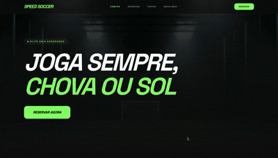
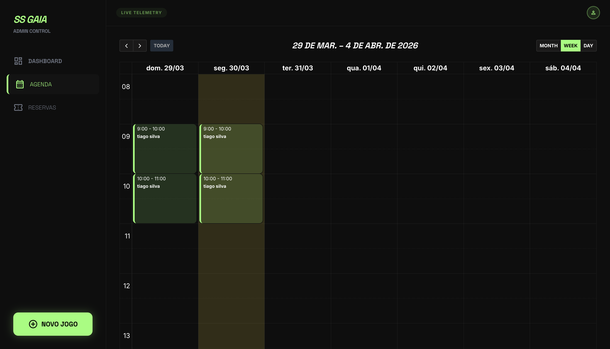
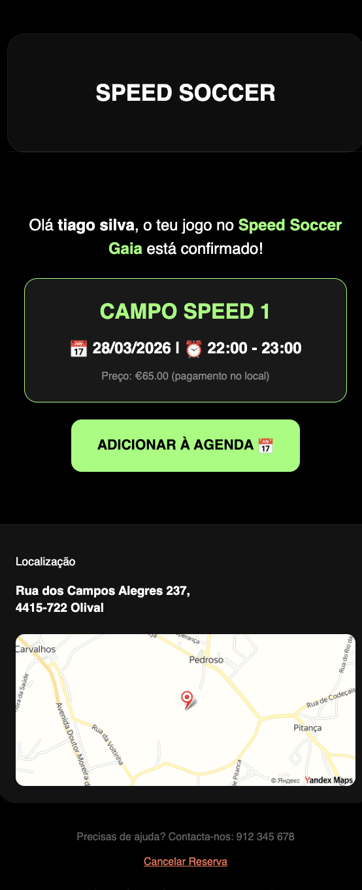

# ⚽ Speed Soccer Gaia - Elite 5-a-side Management System

**Speed Soccer Gaia** is a high-performance web ecosystem designed to bridge the gap between elite sports facilities and the modern player. 

This project was developed with a personal passion: as a regular player at Speed Soccer every Saturday, I wanted to create a tool that not only simplifies bookings but actively helps the center grow—attracting the next generation of stars to the **Youth Academy (Escolinha)**, filling slots for **Individual Training**, and making **Birthday Parties** the talk of the town.

---

## 🌟 Vision & Purpose
The goal is simple: **More play, less admin.**
* **For Kids:** A gateway to the *Escolinha* and Individual Training to forge future champions.
* **For Parents:** Effortless booking for the ultimate football-themed Birthday Party.
* **For Players:** A "Fast Booking" experience to secure the Saturday morning slots we all love.

---

## 🚀 Key Features

### 1. Fast Booking Engine (User-Centric)
A multi-step, mobile-responsive booking form designed for speed. 
* **Visual Availability:** Pick "Campo 1" or "Campo 2" and see open slots instantly.
* **Conversion Focused:** Specifically designed to reduce friction, encouraging more bookings for late-night matches or weekend tournaments.

> [!TIP]
> **Interface em Ação:**
> 

### 2. Tactical Admin Dashboard
Facility managers get a "cockpit" view of the center's performance.
* **Real-time Revenue:** Tracking monthly growth and booking frequency.
* **Manual Terminal:** Quick-entry system for walk-in clients or over-the-phone reservations.

> [!NOTE]
> **Gestão de Reservas:**
> 

### 3. Interactive Schedule (Live Agenda)
A pro-grade calendar interface powered by **FullCalendar JS**.
* **Drag & Drop:** Reschedule matches instantly to optimize pitch occupancy.
* **Live Telemetry:** A pulsing "Live" status that gives the manager total control over the day's workflow.

### 4. Premium Confirmation System (Email)
Every booking triggers a high-end, Dark Mode HTML email. 
* **Instant Professionalism:** Clients receive a receipt that looks as good as the facility feels.
* **Google Calendar Integration:** A one-click button to add the match to their personal schedule.
* **Self-Service:** Includes a secure, tokenized link for easy cancellations, freeing up the slot automatically if plans change.

> [!IMPORTANT]
> **Email de Confirmação Profissional:**
> 

---

## 🛠️ Tech Stack
* **Backend:** PHP 8+ (Native).
* **Database:** MySQL (PDO) with optimized relations.
* **Mailing:** PHPMailer (SMTP) for reliable delivery.
* **Styling:** Tailwind CSS & Space Grotesk Typography.
* **Security:** Environment Variables (.env) to mask sensitive SMTP and DB credentials.

---

## 📂 Project Structure
```text
├── config/
│   ├── db.php            # Database connection & Security
│   └── env_loader.php    # Protection for private keys
├── public/admin/
│   ├── admin.php         # Tactical Dashboard
│   ├── agenda.php        # Interactive Calendar
│   └── reserva.php       # Manual Booking Terminal
├── templates/
│   └── sidebar.php       # Unified Admin Navigation
├── index.php             # Frontend: Landing, Academy & Booking
├── fazer_reserva.php     # The "Engine": Logic & Notifications
└── cancelar.php          # Secure Cancellation Gateway
